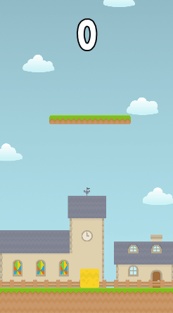

# Jumpy
One-tap platform game made in [Godot Engine](https://github.com/godotengine), a free and open source 2D and 3D game engine. You make a jelly-like thing called **Jumpy** to jump buy tapping to screen or presing the space key. A simple, but fun and addictive game.

This project contains nice examples for signals, groups and C# scripting for people who wants to work with Godot Engine. Although originally planned to be released for smartphones, it is only released for Linux and Windows, because Godot Engine does not support exporting to Android or iOS platforms at the moment.

## Animation

## Licensing
This project is distributed under the MIT license, as described in the LICENSE.md file.

## Art credits
Huge thanks to [Kenney](https://kenney.nl/) for its adorable and free graphics.
